#### TIMER-IP
1.Overview

1.1. Introduction
Timer is an essential module for every chip. 
This is used to generate accurate timing interval or controlling the timing of various operations within the circuit. Timer can be used in various application: pulse generation, delay generation, event generation, PWM generation, Interrupt generation …. 
▪ In this project, a timer module is customized from CLINT module of industrial RISC-V architecture. It is used to generate interrupt based on user settings.

1.2. Main features
The timer has following features: 
 - 64-bit count-up 
 - 12-bit address 
 - Register set is configured via APB bus (IP is APB slave).
 - Support wait state (1 cycle is enough) and error handling 
 - Support byte access 
 - Support halt (stop) in debug mode
 - Timer uses active low async reset. 
 - Counter can be counted based on system clock or divided up to 256. 
 - Support timer interrupt (can be enabled or disabled).

 1.3. Block diagram

  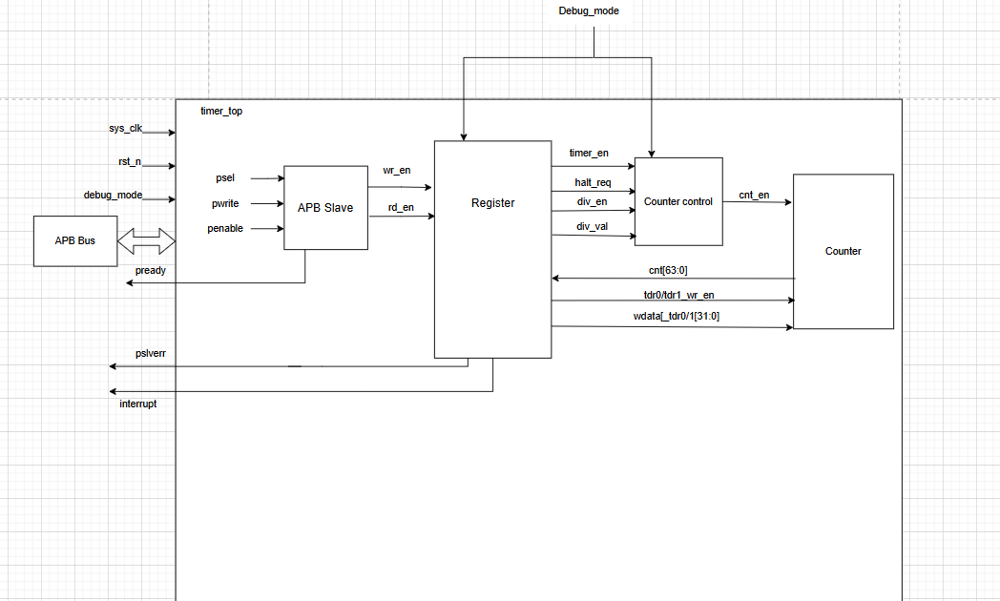

Figure 1: block diagram of Timer IP

--------------------------------------------------------------------------
. Interrupt is a mechanism used to temporarily halt the normal execution flow of a CPU to handle specific events or conditions. 
- Based on the source of interrupt 
 -Hardware interrupt 
 -Software interrupt 
- Based on the ability to mask the interrupt 
 -Maskable interrupt 
 -Non-maskable interrupt 
- Based on the characteristic of the interrupt 
 -Level interrupt 
 -Edge interrupt

 -------------------------------------------------------------------------

Debug mode is a special state in the system that allows users to monitor, analyze and troubleshoot the behavior of the system during development or testing.

 -------------------------------------------------------------------------

 Counter 
 -64-bit count-up. 
 -Counting mode: 
 -Default mode: counter’s speed is same as system clock. 
 -Control mode: when enabled by writing 1 to TCR.div_en bit, the counter's speed is determined by the divisor value set in TCR.div_val 
 -Counter continues counting when interrupts occurs. 
 -Counter continues counting when overflow occurs.

 -------------------------------------------------------------------------

 Support halted mode describe in next page. 
When timer_en changes from High to Low, the counter is cleared to its initial value. When 
timer_en is L->H again, timer can work normally.

--------------------------------------------------------------------------

- Halted mode 
Counter can be halted (stopped) in debug mode when both below conditions occur: 
Input debug_mode signal is High, 
THCR.halt_req is 1.

---------------------------------------------------------------------------
THCSR.halt_ack is 1 after a halt request indicates that the request is accepted. 
After halted, counter can be resumed to count normally when clearing the halt request to 0. 
The period of each counting number needs to be same when halt and not halt as described in the below waveform 
example (div_val=2).

---------------------------------------------------------------------------

Timer Interrupt 
▪ Timer interrupt (tim_int) is asserted (set) when interrupt is enabled and counter’s value matches 
(equal) the compare value. 
▪ Once asserted, the timer interrupt (tim_int) remains unchange until it is cleared by writing 1 to 
TISR.int_st bit or the interrupt is disabled.

--------------------------------------------------------------------------

Counting mode: 
. In default mode, counting speed depend on system clock (same as div_val=0 case as below waveform). 
. The counting’s speed can be controlled by register settings by setting into TCR.div_en and TCR.div_val[3:0] as the register specification 
. div_en and div_val can not be changed during timer_en is High.
. Not allow to change div_en and div_val while timer_en is High by an error response when user mistakenly accesses.

--------------------------------------------------------------------------

APB slave / Register 
▪ Read/write to reserved area is RAZ/WI (read as zero, write ignored)
Support byte access: bus can access to individual bytes in the register. 
. Support wait state (1cycle) to improve the timing. 
. Support error handling for some prohibited access: 
. write prohibited value to TCR.div_val 
. div_en or div_val changes during timer is operating 
. When error occurs, data is not written into register bit/fields

2. Register Specification

  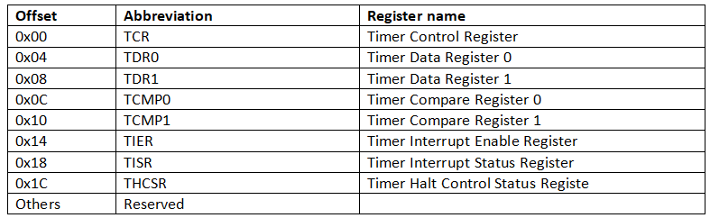

3. Functional Description
3.1. APB slave

  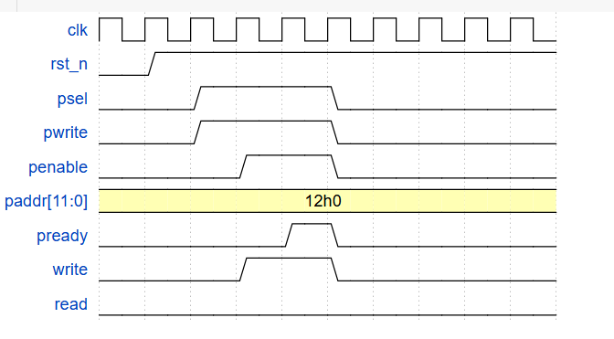
 
  Diagram

  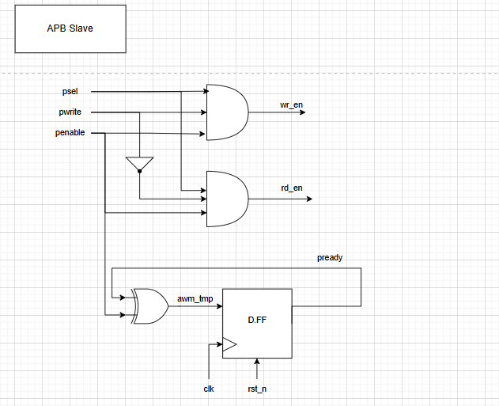
  
  3.2 REGISTER 

  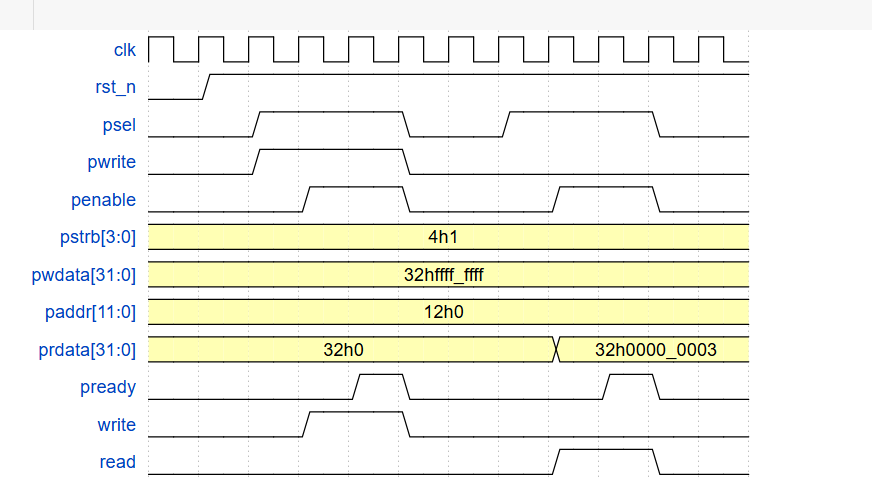

Diagram
TCR

  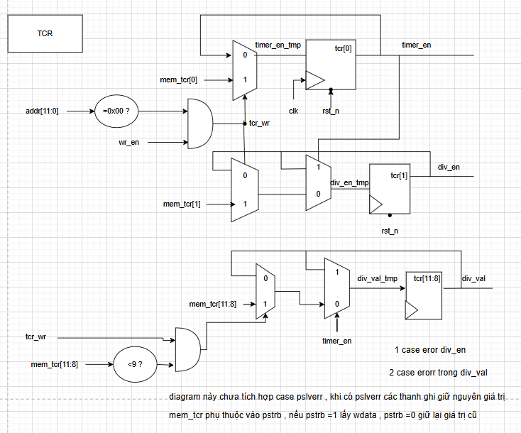

TDR0/1

  

TCMP AND TISR
Diagram

  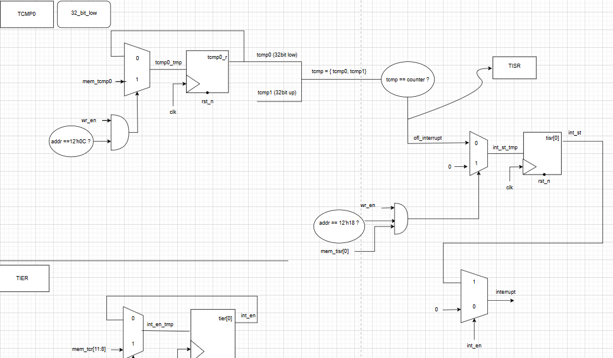

TIER
Diagram

  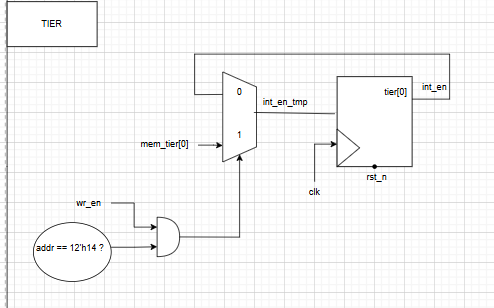

THCSR
Diagram

  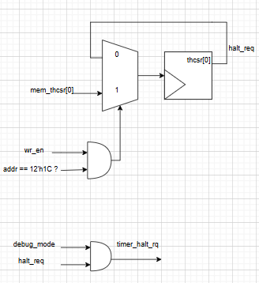

Testcase

  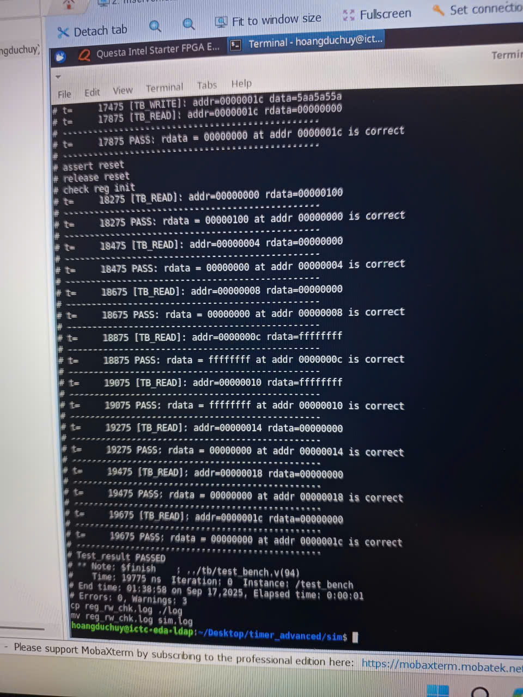

Kết quả của Golden model

  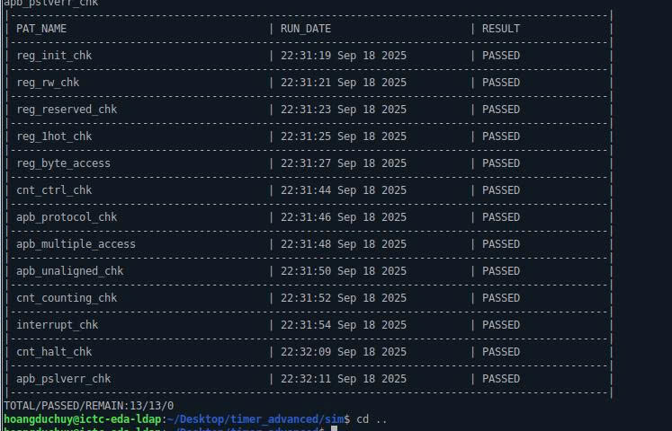

Coverage

  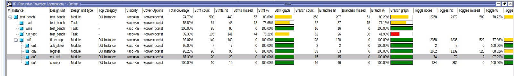